# Ejercicio de Markdown

## Instalación de dotnet core 2.2.

lo primero que tenemos que hacer es  bajar el archivo
[lugar](https://dotnet.microsoft.com/download/dotnet-core/3.0)
es importante bajar el SDK por que **vamos a programar**.

la pagina se ve asi:

Paso 2: Entrar a la página oficial de Visual studio code

https://code.visualstudio.com/

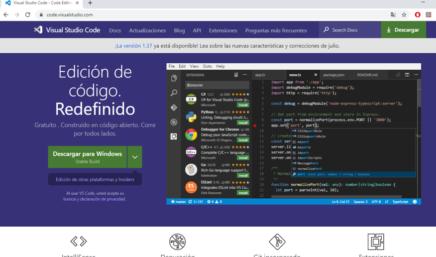

Paso 3: Dar click en el botón que dice descargar para Windows.

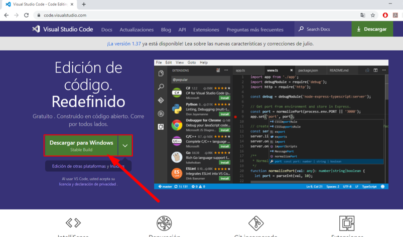

Si no tiene Windows selecciona la opción de alado que se le indica y descargue según la plataforma de su ordenador.

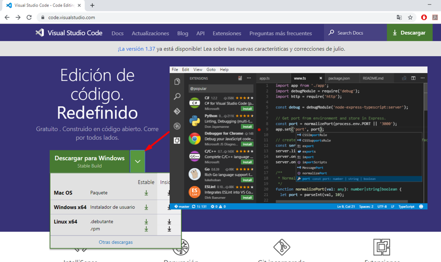

Si su ordenador tiene un sistema operativo de 32 bits seleccione la opción de “Otras descargas”, se abrirá otra página en donde vendrán las opciones de descarga, elija la de su conveniencia.

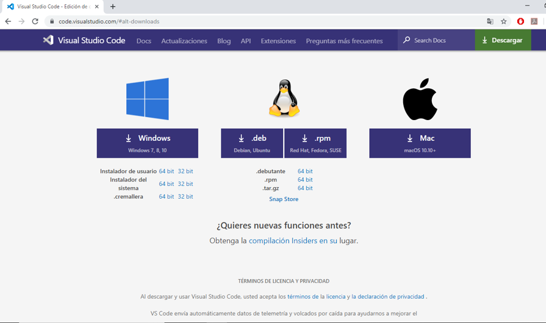

Una vez seleccionado la opción a descargar se abrirá otra página y su descarga comenzará automáticamente.

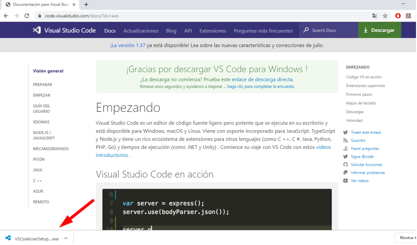

Paso 4: Dar click derecho al archivo descargado y seleccionar donde dice “Mostrar en carpeta”.

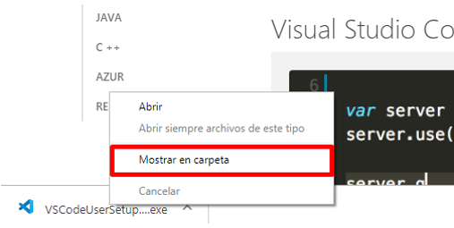

Ahí lo mandara a la carpeta en donde se descargó el archivo de Visual Studio Code.

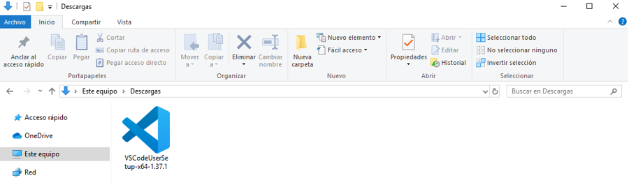

Paso 5: Seleccionamos el archivo descargado en la carpeta, damos “ENTER” y nos aparecerá el acuerdo de licencia del Visual Studio Code, leemos la información que se nos proporciona y una vez leído damos al botón donde dice “Acepto el acuerdo” y después damos a “Siguiente”.

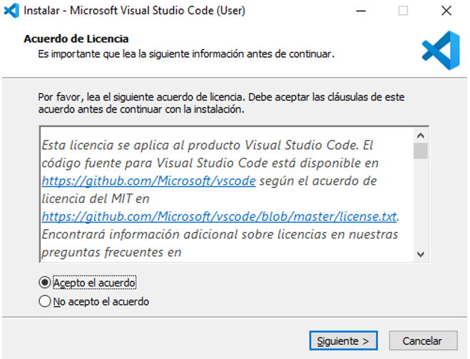

Paso 6: Selecciona “EXAMINAR” para buscar una carpeta donde desee instalara Visual Studio Code o seleccione “SIGUIENTE” para instalar en la carpeta que se le proporciono.

Paso 7: Seleccione “EXAMINAR” para indicar la carpeta en donde se colocarán los accesos directos del Visual Studio Code, si no desea crear una carpeta, marque el cuadro en donde dice “No crear una carpeta en el Menú Inicio” o si quiere mantener la carpeta en donde se le indica, de click en “SIGUIENTE”.

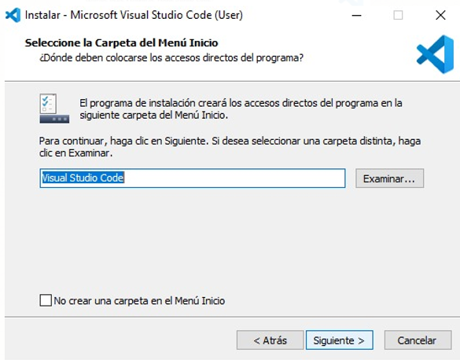

Paso 8: Seleccione las opciones que no están marcadas para permitir que Visual Studio Code:
1. Cree un acceso directo en el escritorio.
2. Agrega la opción de “abrir con code” al menú contextual de archivo del explorador de Windows.
3. Agrega la opción de “abrir con code” al menú contextual de directorio del explorador de Windows.
4. Registrar code como editor para archivos que sean admitidos.

Paso 9: Una vez concluido los pasos para preparar la instalación le aparecerá un marco con todos los preparativos que se hicieron y ya puede comenzar la instalación, de click en el botón e “INSTALAR”, si hay algún cambio que desee realizar antes de instalar solo tiene que oprimir el botón de “ATRÁS”, si no quiere instalar Visual Studio Code seleccione la opción de “CANCELAR”

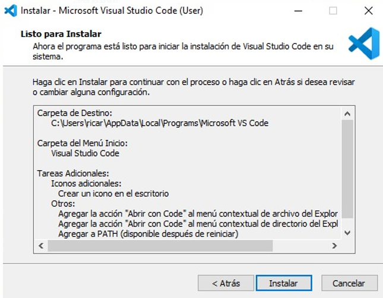

Paso 10: Una vez instalada Visual Studio Code crearemos una carpeta en el escritorio del ordenador con el nombre que usted desee.
Daremos click derecho y seleccioaremos “OPEN WITH CODE”

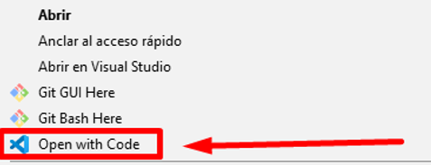

Esa carpeta se abrirá con el Visual Studio Code

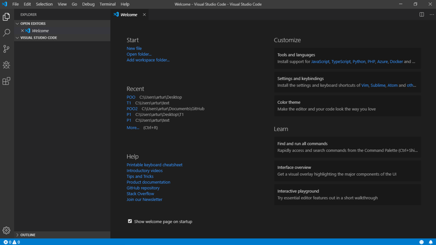

Asi podemos comprobar que la aplicacion se ejecuta sin problemas.

